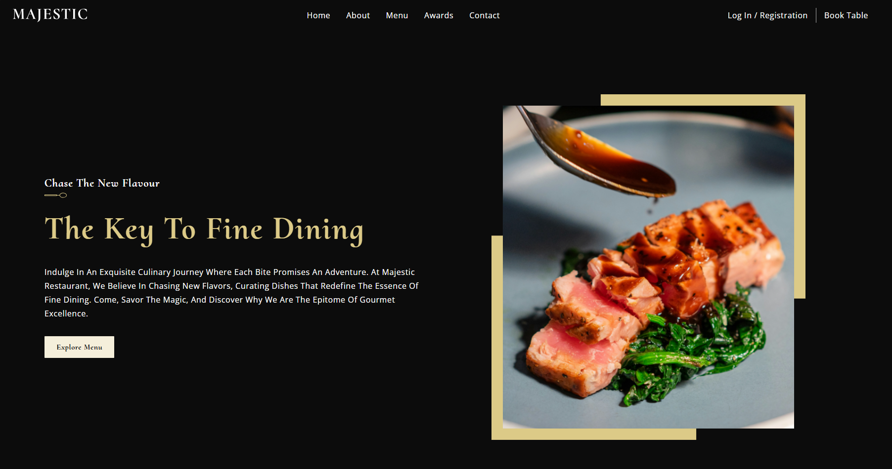
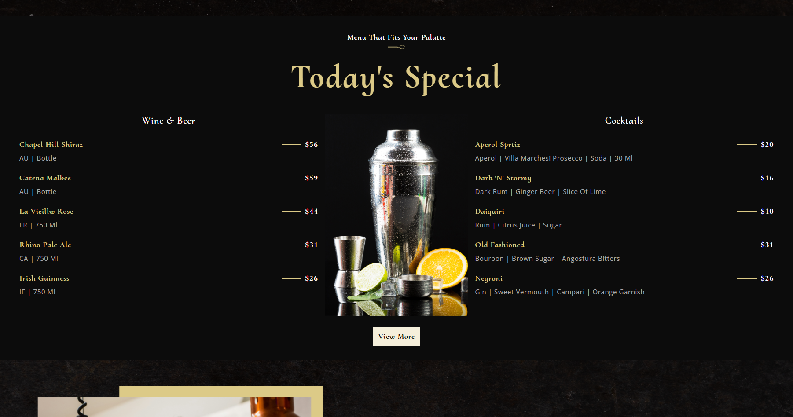
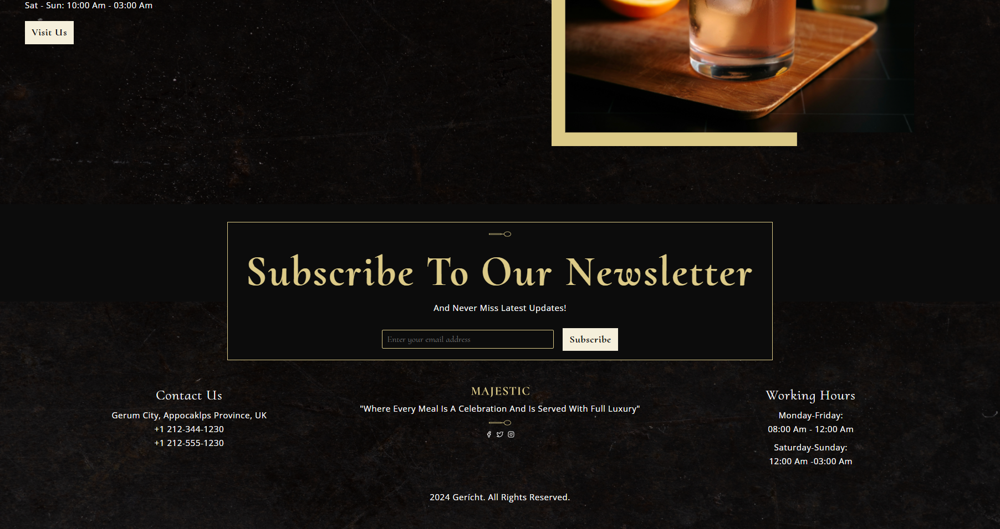

# Project Management App
Sebuah halaman utama website restoran responsive yang bernama majestic-restaurant yang digunakan untuk mengenalkan retoran tersebut secara umum. Mulai dari perkenalan awal, menu, kontak, dan lainnya

## Daftar Isi
- [Tumpukan Teknologi](#tumpukan-teknologi)
- [Fitur](#fitur)
- [Dokumentasi Halaman](#dokumentasi-halaman)
- [Cara Instalasi](#cara-instalasi)
- [Cara Penggunaan](#cara-penggunaan)

## Tumpukan Teknologi
### Frontend
- **ReactJS**: Perpustakaan UI untuk membangun antarmuka pengguna
- **CSS (Cascading Style Sheets)**: Bahasa stylesheet untuk mengatur tampilan dokumen web

### Metodologi CSS
- **BEM (Block Element Modifier)**: Metodologi penamaan kelas CSS yang membantu dalam struktur dan pemeliharaan kode CSS. Dengan BEM, kelas-kelas diberi nama berdasarkan struktur blok, elemen, dan modifikator.

## Tampilan Website
- **Navbar =** halaman navigasi untuk mengarahkan ke beberapa halaman dan untuk otentikasi pengguna
- **Hero =** halaman perkenalan restoran ke pengguna
- **Tentang Restoran =** deskripsi restoran lebih rinci lagi
- **Sejarah Restoran =** sejarah restoran dari awal beridiri
- **Menu Spesial =** tampilan menu unggukan di restoran 
- **Sambutan Pemilik =** sambutan kata - kata kepada pengguna 
- **Tampilan Restoran =** tampilan susana restoran dengan video
- **Penghargaan =** penghargaan restoran yang telah diraih
- **Galeri =** galeri beberapa menu restoran
- **Langganan Berita =** langganan ke berita yang terjadi di restoran
- **Informasi Kontak =** kontak untuk menghubungi maupun mengetahui alamat

## Beberapa Dokumentasi Halaman
##### 1. Halaman Awal


##### 2. Halaman Menu


##### 3. Halaman Kaki


## Cara Instalasi
Instruksi langkah demi langkah untuk menginstal proyek Anda secara lokal.

```bash
# Clone repository ini
git clone https://github.com/defrijay/Majestic-Morsels-Restaurant.git

# Masuk ke direktori proyek
cd repository-name

# Instal dependensi
npm install

# Jalankan server kodenya secara live
npm start --watch

# Buka url servernya
 http://localhost:3000
